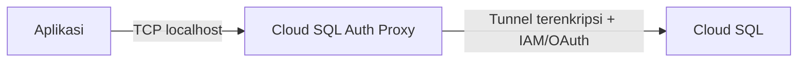

# Cloud SQL — Networking & Security (Console)

Panduan **Google Cloud Console** dan **CLI** untuk konektivitas serta keamanan **Cloud SQL**. Istilah teknis (VPC, SSL, IAM, dll.) tetap dalam **bahasa Inggris**; narasi dalam **Bahasa Indonesia**.

**Console path umum instance:** `Google Cloud Console` → **SQL** → pilih **instance**

---

## 1. Private IP (VPC Peering)

**Private IP** membuat instance Cloud SQL hanya punya alamat **internal** di VPC Anda, tanpa exposure ke internet untuk traffic database. Di balik layar, GCP memakai **VPC Network Peering** antara VPC Anda dan jaringan layanan Google (**Service Networking** / `servicenetworking.googleapis.com`).

**Console path:** **SQL** → instance → **Connections** → tab **Networking** → **Private IP** (enable) → pilih **VPC network** (dan **allocated IP range** jika perlu)

**Alur singkat setup (ringkasan):** buat **private services access** (allocated range + connection ke Service Networking), lalu aktifkan Private IP di instance dan pilih VPC yang sama.

| Kelebihan | Kekurangan |
|-----------|------------|
| Traffic database tidak keluar ke **public internet**; surface attack lebih kecil | Setup awal lebih kompleks (range, peering, firewall rules) |
| Latency biasanya lebih baik untuk workload di **same region** | Aplikasi harus berjalan di resource yang bisa **reach** VPC tersebut (VM, GKE, Cloud Run dengan Serverless VPC Access, dll.) |
| Cocok untuk **least privilege** network (hanya subnet/internal yang boleh akses) | Perlu perencanaan **IP range** agar tidak overlap dengan subnet existing |
| Align dengan **compliance** yang meminta data plane internal | **Cross-project** atau multi-VPC butuh desain tambahan (Shared VPC, hub-spoke, dll.) |

**CLI (contoh patch instance ke VPC + Private IP):**

```bash
# Alokasi range untuk private services access (sekali per VPC, pola umum)
gcloud compute addresses create google-managed-services-default \
  --global \
  --purpose=VPC_PEERING \
  --prefix-length=16 \
  --network=projects/PROJECT_ID/global/networks/VPC_NAME

gcloud services vpc-peerings connect \
  --service=servicenetworking.googleapis.com \
  --ranges=google-managed-services-default \
  --network=VPC_NAME \
  --project=PROJECT_ID

# Aktifkan Private IP pada instance (setelah range & peering siap)
gcloud sql instances patch INSTANCE_ID \
  --project=PROJECT_ID \
  --network=projects/PROJECT_ID/global/networks/VPC_NAME \
  --no-assign-ip
```

> Catatan: urutan dan flag bisa sedikit berbeda tergantung engine dan apakah instance sudah ada **public IP**; selalu cek dokumentasi resmi untuk engine Anda.

**Perbandingan akses (Private IP vs Public IP + authorized networks):**

| Aspek | Private IP | Public IP + authorized networks |
|-------|------------|-----------------------------------|
| Jalur traffic | Internal VPC / peering | Internet ke **public endpoint** |
| Model kepercayaan | **Firewall** + routing VPC | **CIDR allowlist** + opsional SSL/proxy |
| Cocok untuk | Production di GCP | Dev cepat, skenario terbatas |
| Ketergantungan | **Private services access** harus sehat | IP klien harus stabil atau sering di-update |

---

## 2. Public IP + Authorized Networks

**Public IP** memberi instance alamat **internet-routable**. **Authorized networks** adalah daftar **CIDR** yang diizinkan menginisiasi koneksi ke endpoint publik tersebut (bukan pengganti autentikasi database).

**Console path:** **SQL** → instance → **Connections** → **Networking** → **Public IP** → **Authorized networks** → **Add network**

**Cara menambah IP di Console:** klik **Add network**, isi **Name** (label) dan **Network** dalam format CIDR, misalnya `203.0.113.10/32` untuk satu host.

| Kelebihan | Kekurangan |
|-----------|------------|
| Akses cepat untuk **development** dari laptop / IP statis kantor | Endpoint database **terpapar di internet** — risiko scanning, brute force, misconfiguration |
| Tidak perlu VPC peering untuk skenario sederhana | IP **berubah** (ISP, VPN, cloud NAT) → maintenance authorized networks |
| Cocok untuk tool eksternal singkat (dengan kontrol ketat) | **Tidak disarankan** untuk production tanpa lapisan tambahan (**Cloud SQL Auth Proxy**, SSL, strong auth) |

**Risiko keamanan (ringkas):** exposure publik, ketergantungan pada firewall IP saja, kebocoran credential + IP allowlist yang terlalu luas (`0.0.0.0/0` sangat tidak disarankan), dan serangan **DDoS** di layer yang perlu ditangani di luar database.

**CLI (contoh authorized network):**

```bash
gcloud sql instances patch INSTANCE_ID \
  --authorized-networks=NAME:CIDR \
  --project=PROJECT_ID
```

---

## 3. Cloud SQL Auth Proxy

**Cloud SQL Auth Proxy** adalah **sidecar / binary lokal** yang membuat koneksi **terenkripsi** ke Cloud SQL tanpa Anda harus mengelola **certificate rotation** secara manual untuk banyak skenario. Proxy melakukan autentikasi ke GCP (biasanya **IAM** atau **credentials** service account) dan membuka **localhost TCP** (atau Unix socket) ke aplikasi.

**Cara kerja (konsep):**

1. Client aplikasi connect ke **127.0.0.1:PORT** (proxy listening).
2. Proxy membangun **secure tunnel** ke **Cloud SQL** menggunakan kredensial GCP yang valid.
3. Cloud SQL memverifikasi identitas dan kebijakan; traffic database mengalir melalui saluran yang dikelola Google.

**Diagram alur (high level):**



| Kelebihan | Kekurangan |
|-----------|------------|
| Mengurangi kebutuhan **whitelist IP** publik dan menyederhanakan akses aman | Proses tambahan (binary, container sidecar, atau connector) di runtime |
| Rotasi dan trust chain ditangani oleh pola resmi Google | Perlu **service account** / IAM yang benar; debugging network sedikit lebih bertingkat |
| Sangat cocok untuk **Cloud Run**, **GKE**, laptop dev | Latency tambahan biasanya kecil tapi ada **hop** ekstra |

**Kapan pakai:** production dengan **least privilege**, **Cloud Run/Functions/GKE** ke Cloud SQL, tim yang ingin menghindari **authorized networks** lebar, atau dev lokal tanpa VPN ke VPC.

**CLI (contoh lokal, instance connection name):**

```bash
./cloud-sql-proxy --port 5432 PROJECT:REGION:INSTANCE
```

(connection name: **SQL** → instance → **Overview** → **Connection name**)

**Connection name** format: `PROJECT_ID:REGION:INSTANCE_ID` — dipakai oleh proxy, beberapa driver, dan automation.

**Kapan tidak cukup hanya proxy:** jika kebijakan organisasi memaksa **semua** jalur melalui **Private IP** saja, gabungkan dengan VPC/connector dan matikan **public IP** jika memungkinkan:

```bash
gcloud sql instances patch INSTANCE_ID --no-assign-ip --project=PROJECT_ID
```

---

## 4. SSL/TLS Connections

Enkripsi **in-transit** antara client dan Cloud SQL. Di Console Anda bisa mengatur apakah koneksi **wajib** memakai SSL dan mengelola **server CA** serta **client certificates** (tergantung engine dan mode).

**Console path:** **SQL** → instance → **Connections** → **Security**

Opsi yang umum: **Enforce SSL** (wajibkan koneksi terenkripsi), unduh **server certificate authority (CA)**, kelola **client certificates** untuk mutual TLS-style authentication ke instance.

| Kelebihan | Kekurangan |
|-----------|------------|
| Melindungi data di jaringan dari **eavesdropping** / **MITM** | **Client cert management** bisa berat operasional jika dipaksakan ke banyak host |
| Memenuhi kebijakan **encryption in transit** | Aplikasi lama kadang sulit di-upgrade ke SSL/TLS penuh |
| Kombinasi baik dengan **public IP** yang sudah dibatasi | Salah konfigurasi CA/verify mode → outage koneksi |

**CLI (contoh patch enforce SSL — MySQL/Postgres flag via patch):**

```bash
gcloud sql instances patch INSTANCE_ID \
  --require-ssl \
  --project=PROJECT_ID
```

> Untuk **client certs**, biasanya melalui Console **Security** atau perintah `gcloud sql ssl-certs create` (MySQL) / setara untuk Postgres sesuai dokumentasi versi Anda.

---

## 5. Private Service Connect (PSC)

**Private Service Connect** menyediakan **private endpoint** konsumen di VPC Anda yang mengarah ke layanan producer (termasuk pola koneksi ke **Cloud SQL** melalui **PSC attachment** / published service, tergantung deployment). Ini alternatif arsitektur yang lebih baru dibanding hanya mengandalkan peering klasik untuk beberapa skenario konektivitas privat.

| Kelebihan | Kekurangan |
|-----------|------------|
| Model **consumer/producer** yang jelas untuk akses privat | Kurva belajar dan **prerequisites** lebih tinggi dari Private IP peering standar |
| Cocok untuk organisasi yang sudah standardisasi **PSC** di banyak layanan | Tidak semua pola lama langsung setara 1:1 — perlu validasi dengan arsitektur tim |
| Membantu isolasi dan **governance** multi-service | Biaya dan kompleksitas **DNS / forwarding** harus diperhitungkan |

**Console path (umum, PSC):** **Network services** → **Private Service Connect** → buat **endpoint** / **published service** sesuai panduan untuk Cloud SQL di region Anda.

**CLI (contoh pola — sesuaikan dengan resource PSC Anda):**

```bash
gcloud compute forwarding-rules create RULE_NAME \
  --network=NETWORK \
  --address=ADDRESS \
  --target-service-attachment=ATTACHMENT_URI \
  --region=REGION
```

> Selalu rujuk dokumentasi resmi **Cloud SQL + PSC** untuk region dan engine yang didukung, karena evolusi fitur cepat.

---

## 6. VPC Peering — Alur Setup (Console, langkah demi langkah)

Tujuan: menyiapkan **private services access** agar **Private IP** Cloud SQL bekerja.

1. Buka **VPC network** → **VPC networks** → pilih VPC target.
2. Tab **Private service connection** (atau **Private services access**).
3. **Allocated IP address ranges** → **Allocate IP range** → tentukan **prefix length** (mis. `/16`) dan nama range.
4. **Private connections to services** → **Create connection** → pilih service **`servicenetworking.googleapis.com`** → hubungkan ke range yang dialokasikan.
5. Tunggu status **Connected**.
6. Buka **SQL** → instance → **Connections** → **Networking** → aktifkan **Private IP** → pilih **VPC** yang sama.
7. Pastikan **firewall rules** mengizinkan traffic dari subnet client (mis. port **3306** / **5432** / **1433**) ke **private IP** instance.
8. Uji dari VM atau workload di VPC yang sama.

**Console vs CLI untuk peering / private services access:**

| | Kelebihan | Kekurangan |
|---|-----------|------------|
| **Console** | Visual status **Connected**, mudah untuk tim non-SRE | Langkah banyak; kurang ideal untuk **repeatable** infrastructure-as-code |
| **CLI / Terraform** | Idempotent, masuk **Git**, review di PR | Perlu paham flag dan urutan dependency |

**CLI ringkasan:** sama seperti bagian 1 (`compute addresses create` + `services vpc-peerings connect` + `sql instances patch`).

---

## 7. Serverless VPC Access

**Serverless VPC Access** menghubungkan **Cloud Run**, **Cloud Functions (gen2)**, atau **App Engine standard** ke VPC sehingga bisa mencapai **Private IP** Cloud SQL (dan resource internal lain).

**Console path:** **VPC network** → **Serverless VPC access** → **Create connector** → pilih **region**, **VPC**, **subnet** (atau custom subnet), **throughput**.

| Kelebihan | Kekurangan |
|-----------|------------|
| Cloud Run/Functions bisa pakai **Private IP** tanpa public endpoint | **Biaya** connector + **quota** throughput perlu diperhatikan |
| Mengurangi kebutuhan **public IP** + authorized networks | **Cold start** / scaling bisa terpengaruh jika desain connector kurang pas |
| Pola standar untuk microservices serverless | Subnet harus punya **IP cukup** untuk instance connector |

**CLI (contoh connector):**

```bash
gcloud compute networks vpc-access connectors create CONNECTOR_NAME \
  --region=REGION \
  --subnet-project=PROJECT_ID \
  --subnet=SUBNET_NAME \
  --min-instances=2 \
  --max-instances=3 \
  --machine-type=e2-micro
```

Lalu di **Cloud Run** (contoh): set **VPC connector** ke connector tersebut dan **egress** yang sesuai (**Private ranges only** bila hanya internal).

---

## 8. IAM Database Authentication

**IAM database authentication** mengizinkan identitas **IAM** (user atau service account) untuk login ke database dengan **token** singkat, menggantikan atau melengkapi password statis (dukungan bervariasi per engine: **Postgres** & **MySQL** punya alur resmi di Cloud SQL).

**Console path:** **SQL** → instance → **Users** → **Add user account** → pilih opsi terkait **Cloud IAM** / **IAM authentication** (label di UI bisa sedikit berbeda per engine).

**Setup (ringkas):**

1. Di **Users**, buat user dengan **IAM authentication** enabled.
2. Di database, berikan **privilege** yang sesuai (sering via `GRANT` / role — ikuti panduan engine).
3. Aplikasi memakai **service account** dengan IAM role minimal, misalnya **`roles/cloudsql.client`**, dan library connector yang mendukung **IAM login** (atau Auth Proxy dengan flag IAM).

| Kelebihan | Kekurangan |
|-----------|------------|
| Tidak menyimpan **password panjang** di secret (bergantung pada pola token) | Perubahan pada aplikasi & library dibanding password klasik |
| **Audit** dan pencabutan akses lewat **IAM** | Kompleksitas troubleshooting permission **IAM vs DB role** |
| Rotasi credential lebih selaras dengan praktik GCP | Tidak semua ORM/tool lama siap tanpa adaptasi |

**CLI (contoh role untuk service account aplikasi):**

```bash
gcloud projects add-iam-policy-binding PROJECT_ID \
  --member="serviceAccount:APP_SA@PROJECT_ID.iam.gserviceaccount.com" \
  --role="roles/cloudsql.client"
```

---

## 9. Ringkasan Best Practices (Keamanan)

**Checklist sebelum production:**

- [ ] **Private IP** aktif untuk workload di GCP; **public IP** dimatikan jika tidak terpakai.
- [ ] **Authorized networks** (jika publik tetap ada) hanya `/32` atau CIDR kantor yang valid — bukan `0.0.0.0/0`.
- [ ] **Cloud SQL Auth Proxy** atau koneksi SSL sesuai standar tim; credential di **Secret Manager**.
- [ ] **Service account** aplikasi punya `roles/cloudsql.client` (atau lebih ketat jika organisasi menyediakan custom role).
- [ ] **Firewall** VPC: deny default, allow hanya dari subnet/connector yang perlu.
- [ ] **Backup** & **high availability** sesuai RTO/RPO (topik terpisah tapi saling kait dengan keandalan).

| Praktik | Mengapa |
|--------|---------|
| Utamakan **Private IP** + jalur VPC untuk production | Kurangi exposure internet pada port database |
| Hindari **`0.0.0.0/0`** di **authorized networks** | Setara membuka database ke seluruh dunia |
| Pakai **Cloud SQL Auth Proxy** atau connector resmi | Enkripsi dan integrasi IAM lebih konsisten |
| Aktifkan **SSL/TLS**; pertimbangkan **enforce SSL** | Lindungi data dalam transit |
| Pakai **IAM database auth** + **least privilege** DB roles | Kurangi secret statis dan permukaan serangan |
| **Firewall rules** minimal di VPC (hanya source yang perlu) | Defense in depth |
| **Secret Manager** untuk password jika masih dipakai | Hindari hardcode di image/container |
| Patch instance, versi minor, dan flag keamanan secara rutin | Mengurangi CVE yang diketahui |
| Pantau **Cloud Audit Logs** & anomali koneksi | Deteksi dini akses mencurigakan |

---

## Referensi cepat Console

| Topik | Path singkat |
|-------|----------------|
| Private / Public IP, authorized networks | **SQL** → instance → **Connections** → **Networking** |
| SSL / enforce / certs | **SQL** → instance → **Connections** → **Security** |
| IAM DB user | **SQL** → instance → **Users** |
| Private services access / peering | **VPC network** → VPC → **Private service connection** |
| Serverless ke VPC | **VPC network** → **Serverless VPC access** |

Dokumen ini bersifat **orientasi operasional**; selalu cocokkan dengan **dokumentasi resmi Google Cloud** untuk perubahan UI, flag `gcloud`, dan ketersediaan fitur per **engine** dan **region**.
